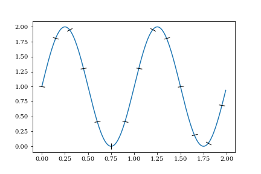
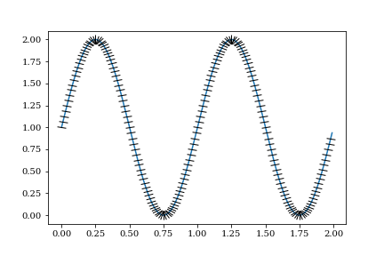

# Plot markers for Matplotlib
This code adds oriented line markers on existing line plots, marking on or between points.

## Example

Running the following code:

```python
x = np.arange(0.0, 2.0, 0.01)
y = 1 + np.sin(2 * np.pi * x)
p = plt.plot(x, y)

plotmark(p[0], np.arange(0.0, 2.0, 0.15))
plt.savefig('example.png')
```

would yield:



In a denser range, the output would be:


